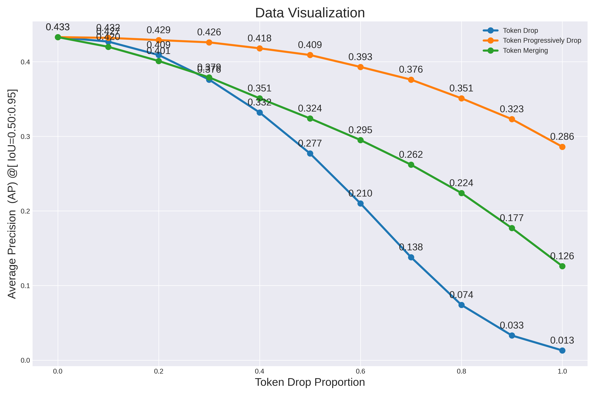

# Usage
## List
- **patch_reuse.py**: 使用（选择）base帧和当前帧，提取base帧的真值信息，当前帧reuse base frame 一定比例的patch。还包括patc_mask功能 随机mask和非ROI mask

- **patch_reuse_evaluate.py**: 同patch_reuse.py 测试整个测试集在reuse patch情况下准确度的变化。base frame 和current frame 设置为 current frame reuse X 帧之前的 base frame。
- **token_reuse_evaluate.py**: --max_reuse_frame 表示在X帧内，后X-1帧 reuse最开始一帧的patchs。测试整个测试集的精度变化。输出为
- **tools/det_token_attention_bbox.py**: 使用YOLOS文章中的技巧，可视化置信度大于阈值的det_tokens的self-attention热力图。
- **tools/detr_attenton_visualizer.py**: 使用detr文章的技巧，可视化encoder中最后一层的self-attention，并以bboxes框中心作为索引值（reference point）可视化当前的热力图。
- **patch_drop.py**: 直接丢弃（不是mask）一定比例的非ROI区域的patch，ROI由真值提供。
- **token_merge.py**: TOKEN Merging : Your ViT But Faster
- **token_reorganizations** : token_reorganizations ICLR'22
  
## History
- 2023.11.1-1 保存token_reuse_evaluate.py 其中 self.merge self.replace功能，merge表示丢弃的一部分token经过average weights后重新形成一个token加入到patch token后面，replace功能表示丢弃的一部分attention weight不太重要的token并用base frame 的token代替，效果都不是太好，探索学习的方法。
- 2023.11.1-2 复现第一版的DynamicViT
- 2023.11.1-2.1 调整了DynamicViT
- 2023.11.1-2.2 调整了DynamicViT
- 2023.11.2-1 更新了DynamicYOLOS Tiny的训练结果，以[0.9,0.9^2,0.9^3]为参数训练的Dynamic ViT，冻结的Backboe, 仅训练head 和 predictor, epoch=200, AP丢失0.031=3.1%
- 2023.11.2-1.1 update readme
- 2023.11.2-1.2 格式化readme
- 2023.11.2-1.3 readme插入图片
- 2023.11.2-2.0 尝试调整backbone的学习率，让backbone lr/1，predictor lr，难以达到近乎原始的效果。下一步复现SViT

## Weights
1. results/DynamicYOLOS_tiny/DynamicYOLOS199_tiny.pth 以[0.9,0.9^2,0.9^3]为参数训练的Dynamic ViT，冻结的Backboe, 仅训练head 和 predictor, epoch=200。

## Result 

### Dynamic YOLOS

  Eval DynamicYOLOS199_tiny.pth 前向过程中在第[3,6,9]个block后只保留[0.9,0.81,0.729]的det-token

  <pre><code>
   Average Precision  (AP) @[ IoU=0.50:0.95 | area=   all | maxDets=100 ] = 0.402
   Average Precision  (AP) @[ IoU=0.50      | area=   all | maxDets=100 ] = 0.785
   Average Precision  (AP) @[ IoU=0.75      | area=   all | maxDets=100 ] = 0.366
  </code></pre>

### YOLOS Base
1. 使用raw YOLOS_B，results/MOT15Det_base/checkpoint0199.pth：
   
    Average Precision  (AP) @[ IoU=0.50:0.95 | area=   all | maxDets=100 ] = 0.467

    Average Precision  (AP) @[ IoU=0.50      | area=   all | maxDets=100 ] = 0.847

    Average Precision  (AP) @[ IoU=0.75      | area=   all | maxDets=100 ] = 0.466

### YOLOS Tiny
1. 使用raw YOLOS_T，results/MOT15Det_tiny/checkpoint0299.pth： [848 x 480]
   
    Average Precision  (AP) @[ IoU=0.50:0.95 | area=   all | maxDets=100 ] = 0.433

    Average Precision  (AP) @[ IoU=0.50      | area=   all | maxDets=100 ] = 0.804

    Average Precision  (AP) @[ IoU=0.75      | area=   all | maxDets=100 ] = 0.416

Reuse None Ground Truth Bboxes Regions

使用 token_reuse_evaluate.py, reuse_frame = 2, drop_proportion = 1.0\
        results/MOT15Det_tiny/checkpoint0299.pth，并且用真值反馈

    <pre><code>
        Average Precision  (AP) @[ IoU=0.50:0.95 | area=   all | maxDets=100 ] = 0.432
        Average Precision  (AP) @[ IoU=0.50      | area=   all | maxDets=100 ] = 0.802
        Average Precision  (AP) @[ IoU=0.75      | area=   all | maxDets=100 ] = 0.415
    </code></pre>

使用 token_reuse_evaluate.py, reuse_frame = 3, drop_proportion = 1.0\
        results/MOT15Det_tiny/checkpoint0299.pth，并且用真值反馈

    <pre><code>
        Average Precision  (AP) @[ IoU=0.50:0.95 | area=   all | maxDets=100 ] = 0.430
        Average Precision  (AP) @[ IoU=0.50      | area=   all | maxDets=100 ] = 0.797
        Average Precision  (AP) @[ IoU=0.75      | area=   all | maxDets=100 ] = 0.415
    </code></pre>

使用 token_reuse_evaluate.py, reuse_frame = 4, drop_proportion = 1.0\
        results/MOT15Det_tiny/checkpoint0299.pth，并且用真值反馈

    <pre><code>
        Average Precision  (AP) @[ IoU=0.50:0.95 | area=   all | maxDets=100 ] = 0.425
        Average Precision  (AP) @[ IoU=0.50      | area=   all | maxDets=100 ] = 0.793
        Average Precision  (AP) @[ IoU=0.75      | area=   all | maxDets=100 ] = 0.413
    </code></pre>

使用 token_reuse_evaluate.py, reuse_frame = 5, drop_proportion = 1.0\
        results/MOT15Det_tiny/checkpoint0299.pth，并且用真值反馈

    <pre><code>
        Average Precision  (AP) @[ IoU=0.50:0.95 | area=   all | maxDets=100 ] = 0.421
        Average Precision  (AP) @[ IoU=0.50      | area=   all | maxDets=100 ] = 0.785
        Average Precision  (AP) @[ IoU=0.75      | area=   all | maxDets=100 ] = 0.403
    </code></pre>

使用 token_reuse_evaluate.py, reuse_frame = 6, drop_proportion = 1.0\
        results/MOT15Det_tiny/checkpoint0299.pth，并且用真值反馈

    <pre><code>
        Average Precision  (AP) @[ IoU=0.50:0.95 | area=   all | maxDets=100 ] = 0.415
        Average Precision  (AP) @[ IoU=0.50      | area=   all | maxDets=100 ] = 0.777
        Average Precision  (AP) @[ IoU=0.75      | area=   all | maxDets=100 ] = 0.397
    </code></pre>

使用 **token_reuse_evaluate.py**, reuse_frame = 7, drop_proportion = 1.0\
        results/MOT15Det_tiny/checkpoint0299.pth，并且用真值反馈

    <pre><code>
        Average Precision  (AP) @[ IoU=0.50:0.95 | area=   all | maxDets=100 ] = 0.410
        Average Precision  (AP) @[ IoU=0.50      | area=   all | maxDets=100 ] = 0.766
        Average Precision  (AP) @[ IoU=0.75      | area=   all | maxDets=100 ] = 0.391
    </code></pre>

Reuse Predicted Bboxes Regions

使用 token_reuse_evaluate.py, reuse_frame = 2, drop_proportion = 1.0\
        results/MOT15Det_tiny/checkpoint0299.pth，base frame 检测值反馈

    <pre><code>
        Average Precision  (AP) @[ IoU=0.50:0.95 | area=   all | maxDets=100 ] = 0.430
        Average Precision  (AP) @[ IoU=0.50      | area=   all | maxDets=100 ] = 0.800
        Average Precision  (AP) @[ IoU=0.75      | area=   all | maxDets=100 ] = 0.411
    </code></pre>

使用 token_reuse_evaluate.py, reuse_frame = 3, drop_proportion = 1.0\
        results/MOT15Det_tiny/checkpoint0299.pth，base frame 检测值反馈

    <pre><code>
        Average Precision  (AP) @[ IoU=0.50:0.95 | area=   all | maxDets=100 ] = 0.426
        Average Precision  (AP) @[ IoU=0.50      | area=   all | maxDets=100 ] = 0.796
        Average Precision  (AP) @[ IoU=0.75      | area=   all | maxDets=100 ] = 0.408
    </code></pre>

使用 token_reuse_evaluate.py, reuse_frame = 4, drop_proportion = 1.0\
        results/MOT15Det_tiny/checkpoint0299.pth，base frame 检测值反馈

    <pre><code>
        Average Precision  (AP) @[ IoU=0.50:0.95 | area=   all | maxDets=100 ] = 0.419
        Average Precision  (AP) @[ IoU=0.50      | area=   all | maxDets=100 ] = 0.788
        Average Precision  (AP) @[ IoU=0.75      | area=   all | maxDets=100 ] = 0.400
    </code></pre>

使用 token_reuse_evaluate.py, reuse_frame = 5, drop_proportion = 1.0\
        results/MOT15Det_tiny/checkpoint0299.pth，base frame 检测值反馈

    <pre><code>
        Average Precision  (AP) @[ IoU=0.50:0.95 | area=   all | maxDets=100 ] = 0.415
        Average Precision  (AP) @[ IoU=0.50      | area=   all | maxDets=100 ] = 0.782
        Average Precision  (AP) @[ IoU=0.75      | area=   all | maxDets=100 ] = 0.398
    </code></pre>

Reuse Proportion:  0.8033412173652144

 使用前 Reuse_frame 帧 Ground Truth 的 bboxes 作为反馈(YOLOS-Tiny) 

|                         | **Reuse_frame=2** | **Reuse_frame=3** | **Reuse_frame=4** | **Reuse_frame=5** |
|-------------------------|:-----------------:|:-----------------:|:-----------------:|:-----------------:|
| **Reuse prop. (%)**     | **AP@0.5:0.95**   | **AP@0.5:0.95**   | **AP@0.5:0.95**   | **AP@0.5:0.95**   |
| **raw**                 | 0.433             | 0.433             | 0.433             | 0.433             |
| **20%**                 | 0.433             | 0.432             | 0.432             | 0.431             |
| **40%**                 | 0.433             | 0.433             | 0.431             | 0.430             |
| **60%**                 | 0.433             | 0.432             | 0.429             | 0.427             |
| **80%**                 | 0.432             | 0.431             | 0.428             | 0.424             |
| **100%**                | 0.432             | 0.430             | 0.425             | 0.421             |

Reuse Proportion:  0.8203114300504226

 使用前 Reuse_frame 帧预测的 bboxes 作为反馈(YOLOS-Tiny) 

|                         | **Reuse_frame=2** | **Reuse_frame=3** | **Reuse_frame=4** | **Reuse_frame=5** |
|-------------------------|:-----------------:|:-----------------:|:-----------------:|:-----------------:|
| **Reuse prop. (%)**     | **AP@0.5:0.95**   | **AP@0.5:0.95**   | **AP@0.5:0.95**   | **AP@0.5:0.95**   |
| **raw**                 | 0.433             | 0.433             | 0.433             | 0.433             |
| **20%**                 | 0.433             | 0.433             | 0.432             | 0.431             |
| **40%**                 | 0.432             | 0.431             | 0.429             | 0.429             |
| **60%**                 | 0.432             | 0.429             | 0.426             | 0.426             |
| **80%**                 | 0.431             | 0.427             | 0.423             | 0.421             |
| **100%**                | 0.430             | 0.426             | 0.419             | 0.415             |

### Token Drop

从第一个block之前随机drop 非ROI区域token

python patch_drop.py --drop_proportion 0.1
    reuse_proportion: 0.09972677595628415

    <pre><code>
        Average Precision  (AP) @[ IoU=0.50:0.95 | area=   all | maxDets=100 ] = 0.427
        Average Precision  (AP) @[ IoU=0.50      | area=   all | maxDets=100 ] = 0.804
        Average Precision  (AP) @[ IoU=0.75      | area=   all | maxDets=100 ] = 0.406
    </code></pre>

python patch_drop.py --drop_proportion 0.2
    reuse_proportion: 0.1994535519125683

    <pre><code>
        Average Precision  (AP) @[ IoU=0.50:0.95 | area=   all | maxDets=100 ] = 0.409
        Average Precision  (AP) @[ IoU=0.50      | area=   all | maxDets=100 ] = 0.801
        Average Precision  (AP) @[ IoU=0.75      | area=   all | maxDets=100 ] = 0.371
    </code></pre>

python patch_drop.py --drop_proportion 0.3
    reuse_proportion: 0.2998633879781421

    <pre><code>
        Average Precision  (AP) @[ IoU=0.50:0.95 | area=   all | maxDets=100 ] = 0.376
        Average Precision  (AP) @[ IoU=0.50      | area=   all | maxDets=100 ] = 0.784
        Average Precision  (AP) @[ IoU=0.75      | area=   all | maxDets=100 ] = 0.316
    </code></pre>

python patch_drop.py --drop_proportion 0.4
    reuse_proportion: 0.39959016393442626

    <pre><code>
        Average Precision  (AP) @[ IoU=0.50:0.95 | area=   all | maxDets=100 ] = 0.332
        Average Precision  (AP) @[ IoU=0.50      | area=   all | maxDets=100 ] = 0.747
        Average Precision  (AP) @[ IoU=0.75      | area=   all | maxDets=100 ] = 0.239
    </code></pre>

python patch_drop.py --drop_proportion 0.5
    reuse_proportion: 0.5

    <pre><code>
        Average Precision  (AP) @[ IoU=0.50:0.95 | area=   all | maxDets=100 ] = 0.277
        Average Precision  (AP) @[ IoU=0.50      | area=   all | maxDets=100 ] = 0.699
        Average Precision  (AP) @[ IoU=0.75      | area=   all | maxDets=100 ] = 0.153
    </code></pre>

python patch_drop.py --drop_proportion 0.6
    reuse_proportion: 0.5997267759562842

    <pre><code>
        Average Precision  (AP) @[ IoU=0.50:0.95 | area=   all | maxDets=100 ] = 0.210
        Average Precision  (AP) @[ IoU=0.50      | area=   all | maxDets=100 ] = 0.605
        Average Precision  (AP) @[ IoU=0.75      | area=   all | maxDets=100 ] = 0.087
    </code></pre>

python patch_drop.py --drop_proportion 0.7
    reuse_proportion: 0.6994535519125683

    <pre><code>
        Average Precision  (AP) @[ IoU=0.50:0.95 | area=   all | maxDets=100 ] = 0.138
        Average Precision  (AP) @[ IoU=0.50      | area=   all | maxDets=100 ] = 0.465
        Average Precision  (AP) @[ IoU=0.75      | area=   all | maxDets=100 ] = 0.033
    </code></pre>

python patch_drop.py --drop_proportion 0.8
    reuse_proportion: 0.8

    <pre><code>
        Average Precision  (AP) @[ IoU=0.50:0.95 | area=   all | maxDets=100 ] = 0.074
        Average Precision  (AP) @[ IoU=0.50      | area=   all | maxDets=100 ] = 0.295
        Average Precision  (AP) @[ IoU=0.75      | area=   all | maxDets=100 ] = 0.010
    </code></pre>

python patch_drop.py --drop_proportion 0.9
    reuse_proportion: 0.8995901639344263

    <pre><code>
        Average Precision  (AP) @[ IoU=0.50:0.95 | area=   all | maxDets=100 ] = 0.033
        Average Precision  (AP) @[ IoU=0.50      | area=   all | maxDets=100 ] = 0.147
        Average Precision  (AP) @[ IoU=0.75      | area=   all | maxDets=100 ] = 0.004
    </code></pre>

python patch_drop.py --drop_proportion 1.0
    reuse_proportion: 1.0

    <pre><code>
        Average Precision  (AP) @[ IoU=0.50:0.95 | area=   all | maxDets=100 ] = 0.013
        Average Precision  (AP) @[ IoU=0.50      | area=   all | maxDets=100 ] = 0.058
        Average Precision  (AP) @[ IoU=0.75      | area=   all | maxDets=100 ] = 0.002
    </code></pre>

### Token Progressively Drop

从十二个block之后逐步drop非ROI区域token

10%

    <pre><code>
        Average Precision  (AP) @[ IoU=0.50:0.95 | area=   all | maxDets=100 ] = 0.432
        Average Precision  (AP) @[ IoU=0.50      | area=   all | maxDets=100 ] = 0.804
        Average Precision  (AP) @[ IoU=0.75      | area=   all | maxDets=100 ] = 0.415
    </code></pre>

20%

    <pre><code>
        Average Precision  (AP) @[ IoU=0.50:0.95 | area=   all | maxDets=100 ] = 0.429
        Average Precision  (AP) @[ IoU=0.50      | area=   all | maxDets=100 ] = 0.806
        Average Precision  (AP) @[ IoU=0.75      | area=   all | maxDets=100 ] = 0.407
    </code></pre>

30%

    <pre><code>
        Average Precision  (AP) @[ IoU=0.50:0.95 | area=   all | maxDets=100 ] = 0.426
        Average Precision  (AP) @[ IoU=0.50      | area=   all | maxDets=100 ] = 0.809
        Average Precision  (AP) @[ IoU=0.75      | area=   all | maxDets=100 ] = 0.404
    </code></pre>

40%

    <pre><code>
        Average Precision  (AP) @[ IoU=0.50:0.95 | area=   all | maxDets=100 ] = 0.418
        Average Precision  (AP) @[ IoU=0.50      | area=   all | maxDets=100 ] = 0.806
        Average Precision  (AP) @[ IoU=0.75      | area=   all | maxDets=100 ] = 0.391
    </code></pre>

50%

    <pre><code>
        Average Precision  (AP) @[ IoU=0.50:0.95 | area=   all | maxDets=100 ] = 0.409
        Average Precision  (AP) @[ IoU=0.50      | area=   all | maxDets=100 ] = 0.806
        Average Precision  (AP) @[ IoU=0.75      | area=   all | maxDets=100 ] = 0.367
    </code></pre>

60%

<pre><code>
    Average Precision  (AP) @[ IoU=0.50:0.95 | area=   all | maxDets=100 ] = 0.393
    Average Precision  (AP) @[ IoU=0.50      | area=   all | maxDets=100 ] = 0.797
    Average Precision  (AP) @[ IoU=0.75      | area=   all | maxDets=100 ] = 0.339
</code></pre>

70%

    <pre><code>
        Average Precision  (AP) @[ IoU=0.50:0.95 | area=   all | maxDets=100 ] = 0.376
        Average Precision  (AP) @[ IoU=0.50      | area=   all | maxDets=100 ] = 0.790
        Average Precision  (AP) @[ IoU=0.75      | area=   all | maxDets=100 ] = 0.309
    </code></pre>

80%

    <pre><code>
        Average Precision  (AP) @[ IoU=0.50:0.95 | area=   all | maxDets=100 ] = 0.351
        Average Precision  (AP) @[ IoU=0.50      | area=   all | maxDets=100 ] = 0.773
        Average Precision  (AP) @[ IoU=0.75      | area=   all | maxDets=100 ] = 0.265
    </code></pre>

90%

    <pre><code>
        Average Precision  (AP) @[ IoU=0.50:0.95 | area=   all | maxDets=100 ] = 0.323
        Average Precision  (AP) @[ IoU=0.50      | area=   all | maxDets=100 ] = 0.757
        Average Precision  (AP) @[ IoU=0.75      | area=   all | maxDets=100 ] = 0.213
    </code></pre>

100%

    <pre><code>
        Average Precision  (AP) @[ IoU=0.50:0.95 | area=   all | maxDets=100 ] = 0.286
        Average Precision  (AP) @[ IoU=0.50      | area=   all | maxDets=100 ] = 0.723
        Average Precision  (AP) @[ IoU=0.75      | area=   all | maxDets=100 ] = 0.155
    </code></pre>

### Token Merging

在每一个block采取ToMe中的token merging策略

10% 分12次Merging 10%的所有token

    <pre><code>
        Average Precision  (AP) @[ IoU=0.50:0.95 | area=   all | maxDets=100 ] = 0.422
        Average Precision  (AP) @[ IoU=0.50      | area=   all | maxDets=100 ] = 0.799
        Average Precision  (AP) @[ IoU=0.75      | area=   all | maxDets=100 ] = 0.392
    </code></pre>

### Evit

在block [3,6,9] 中使用Evit策略，根据attention weight 保留一些token，再merging一些token

 keep_rate = 1.0： [848 x 480]

    <pre><code>
        Average Precision  (AP) @[ IoU=0.50:0.95 | area=   all | maxDets=100 ] = 0.433
        Average Precision  (AP) @[ IoU=0.50      | area=   all | maxDets=100 ] = 0.804
        Average Precision  (AP) @[ IoU=0.75      | area=   all | maxDets=100 ] = 0.416
    </code></pre>

keep_rate = 0.9:

    <pre><code> 
        Average Precision  (AP) @[ IoU=0.50:0.95 | area=   all | maxDets=100 ] = 0.421
        Average Precision  (AP) @[ IoU=0.50      | area=   all | maxDets=100 ] = 0.800
        Average Precision  (AP) @[ IoU=0.75      | area=   all | maxDets=100 ] = 0.401
    </code></pre>

python token_reuse_evaluate.py --max_reuse_frame 5 --drop_proportion 1.0 block [3,6,9] 保留前95% topk token

    <pre><code> 
        Average Precision  (AP) @[ IoU=0.50:0.95 | area=   all | maxDets=100 ] = 0.399
        Average Precision  (AP) @[ IoU=0.50      | area=   all | maxDets=100 ] = 0.769
        Average Precision  (AP) @[ IoU=0.75      | area=   all | maxDets=100 ] = 0.371
    </code></pre>

python token_reuse_evaluate.py --max_reuse_frame 5 --drop_proportion 1.0 block [3,6,9] 保留前95% topk token 并且merge 剩下的5% token

    <pre><code> 
        Average Precision  (AP) @[ IoU=0.50:0.95 | area=   all | maxDets=100 ] = 0.400
        Average Precision  (AP) @[ IoU=0.50      | area=   all | maxDets=100 ] = 0.770
        Average Precision  (AP) @[ IoU=0.75      | area=   all | maxDets=100 ] = 0.371
    </code></pre>

python token_reuse_evaluate.py --max_reuse_frame 5 --drop_proportion 1.0 block [3,6,9] replace 剩下的10%不重要的token

    <pre><code> 
        Average Precision  (AP) @[ IoU=0.50:0.95 | area=   all | maxDets=100 ] = 0.400
        Average Precision  (AP) @[ IoU=0.50      | area=   all | maxDets=100 ] = 0.766
        Average Precision  (AP) @[ IoU=0.75      | area=   all | maxDets=100 ] = 0.372
    </code></pre>

python token_reuse_evaluate.py --max_reuse_frame 5 --drop_proportion 1.0 block [3,6,9] 保留前90% topk token

    <pre><code> 
        Average Precision  (AP) @[ IoU=0.50:0.95 | area=   all | maxDets=100 ] = 0.367
        Average Precision  (AP) @[ IoU=0.50      | area=   all | maxDets=100 ] = 0.731
        Average Precision  (AP) @[ IoU=0.75      | area=   all | maxDets=100 ] = 0.331
    </code></pre>

